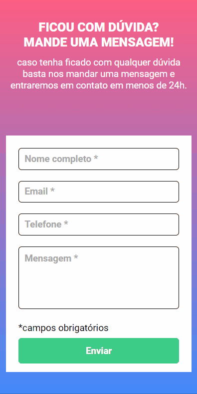

<h1 align="center">
   Formulário com validação
</h1>

 

## 💻 Projeto

Formulário com validação feito com JavaScript para validar se todos os campos foram preenchidos pelo usuário antes de enviar o formulário.

## 📷 Demonstração

  ### Mobile 📱  
  

   
  
  ### Desktop 💻
  

 

## 🚀 Tecnologias utilizadas:

✔️ JAVASCRIPT

✔️ HTML

✔️ CSS